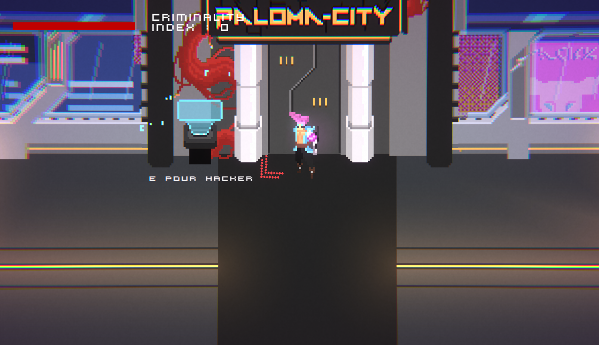
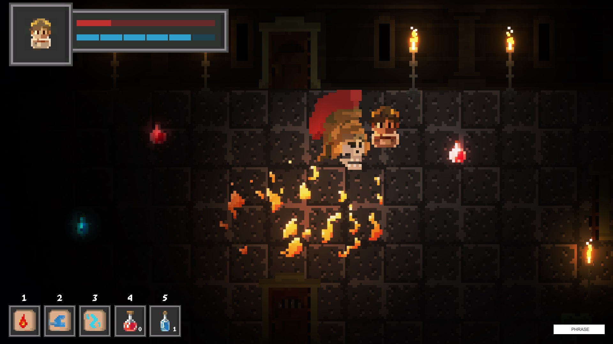
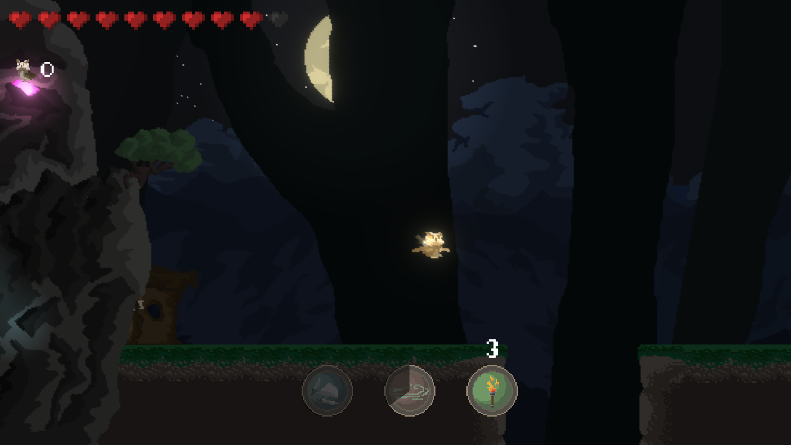

<h1>About me</h1>

M1 student in Rennes, France. I always wanted to specialize in digital imaging and video games. 
That's why I created my video game studio in 2021. I've published 3 small mobile games and a management/strategy game on pc. These are no longer available, as my skills have evolved and I don't feel that these projects are mature enough. 
However, you can test my <a href="https://althior.itch.io">game jam entries</a>

<h1>Portfolio</h1>

Some of the games I've made (2D art by <a href="https://github.com/RemiCazoulat/">Rémi Cazoulat</a>) : 

  

    
    
    
    
    
    

<h1>About Askoed</h1>

Askoed is the name of my video game studio. I'm currently working on a new project with a team of 5 people. 
Follow us so you don't miss any news!

<ul>
  <li><a href="https://askoed.com/">Website</a></li>
   <li><a href="https://discord.com/invite/TrytaAFKpF">Discord</a></li>
   <li><a href="https://twitter.com/AskoedStudio">Twitter</a></li>
   <li><a href="https://www.instagram.com/askoed_official/">Instagram</a></li>
</ul>
